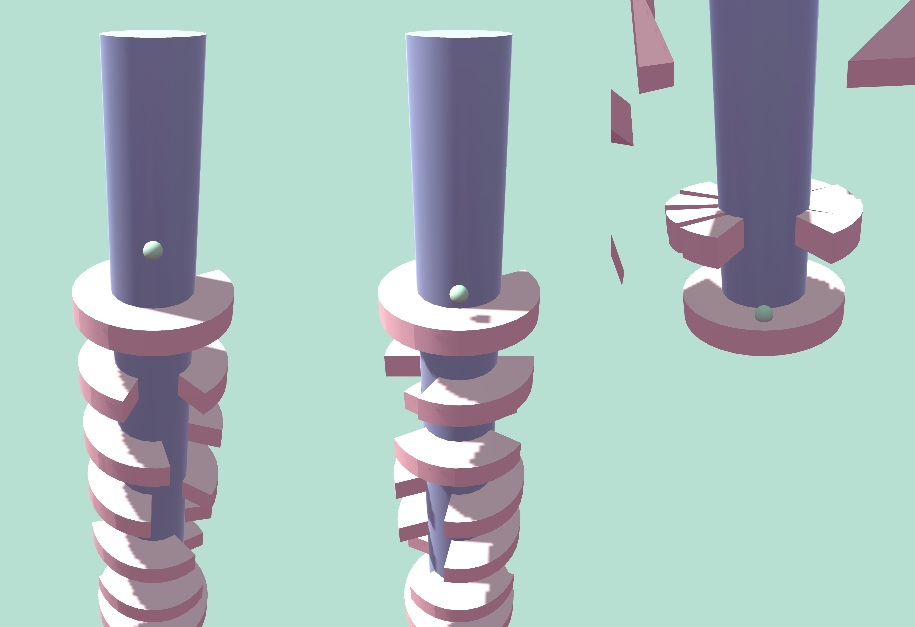
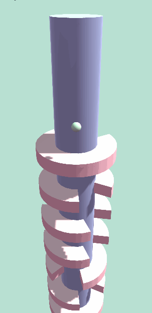

<h1 align="center"> Helix Jump </h1>

 

Cloning the gameplay mechanics of the popular mobile game **Helix Jump**.

 

 

## Description of components

There are three main game components - a **[ball](https://github.com/daridakr/Helix-Jump/blob/main/HelixJump/Assets/Scripts/Ball/Ball.cs)**, a **[platform](https://github.com/daridakr/Helix-Jump/blob/main/HelixJump/Assets/Scripts/Platforms/Platform.cs)** and a **[tower](https://github.com/daridakr/Helix-Jump/blob/main/HelixJump/Assets/Scripts/Tower/Tower.cs)**.

**Ball** consists of the **Jumper** and **Traking** components. [Jumper component](https://github.com/daridakr/Helix-Jump/blob/main/HelixJump/Assets/Scripts/Ball/BallJumper.cs) is responsible for ball jumping over the platforms. [Traking component](https://github.com/daridakr/Helix-Jump/blob/main/HelixJump/Assets/Scripts/Ball/BallTraking.cs) monitors the correct tracking of the ball by the camera during the game.

**Tower** consists of **Builder** and **Rotator** components. [Builder component](https://github.com/daridakr/Helix-Jump/blob/main/HelixJump/Assets/Scripts/Tower/TowerBuilder.cs) is responsible for the tower building/spawning in the game space with the set count of levels and platforms. [Rotator component](https://github.com/daridakr/Helix-Jump/blob/main/HelixJump/Assets/Scripts/Tower/TowerRotator.cs) is responsible for tower scrolling by touches.  

There are three types of platforms - **platform**, **finish platform** and **[spawn platform](https://github.com/daridakr/Helix-Jump/blob/main/HelixJump/Assets/Scripts/Platforms/SpawnPlatform.cs)**. Spawn and finish platforms are derived from platform. Each platform consists of separate parts - **[platform segments](https://github.com/daridakr/Helix-Jump/blob/main/HelixJump/Assets/Scripts/Platforms/PlatformSegment.cs)**. Except finish and spawn platforms, other ones **break to segments** when the ball flies through them. Spawn platform drops the ball.

 

## Demonstration

 